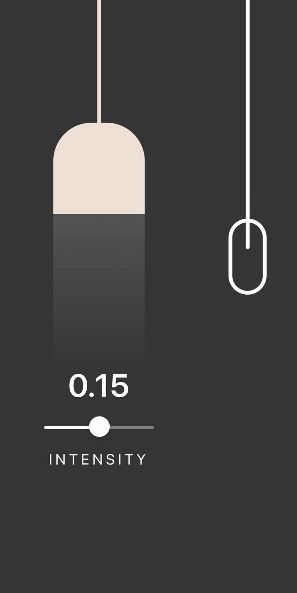

# Projet React Native - Animation d'une Lampe

## Description
J'ai développé un petit projet React Native où l'utilisateur peut interagir avec une lampe :

- **Allumer la lampe** : En tirant sur une corde avec son doigt.
- **Régler l'intensité de la lumière** : À l'aide d'un slider.

## Installation
Pour installer les dépendances nécessaires, exécutez la commande suivante :
```bash
npm i
```

## Lancer le projet
Pour démarrer le projet, utilisez la commande suivante :
```bash
npx expo start

```

## Portfolio

Pour en savoir plus sur mes projets, visitez mon [portfolio](https://calebthedev.netlify.app/)


